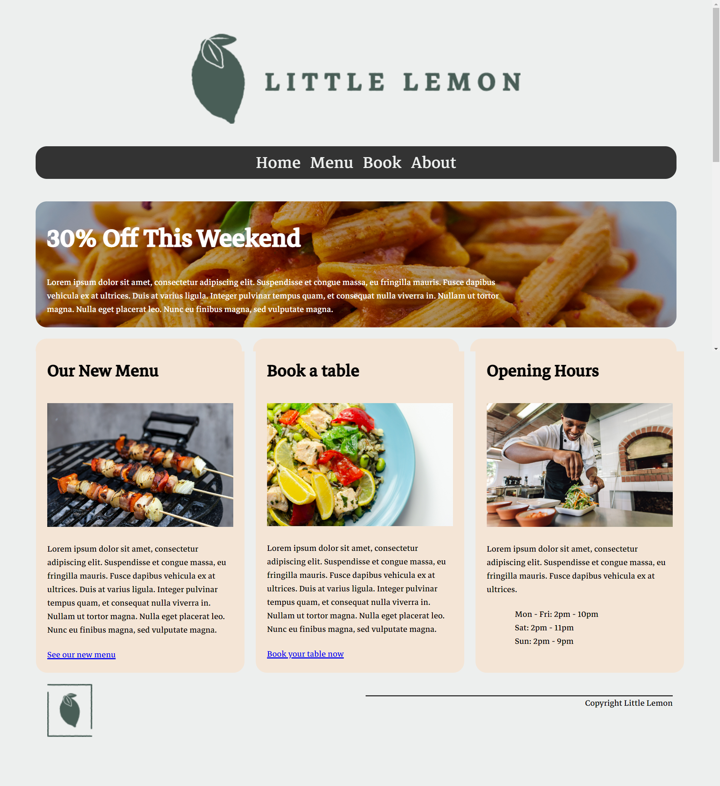

# Subject selection
For the graded assessment, you need to develop a home page for one of four fictional clients. As you read through the client personas included in this reading, think about what the ideal home page for each of these clients would look like.   

How can you use what you’ve learned over the course? For instance, how will you structure the provided information with semantic HTML tags? You can even start to think about what media elements you could include.   

And how can you create a unique user experience with CSS? Will a grid or basic flexbox serve the client best? What CSS selectors will you use to not only style your page but also create interactivity? And don’t forget about effects! It’s time to have fun and think about how you can apply what you learned about CSS animations.   

The four client personas offer a great variety for you to choose from. They are:  

* Retail: Lucky Shrub  
* Professional services: Hair Day  
* Restaurant: Little Lemon  
* Luxury jewelry: Mangata and Gallo
* Read on to find out more about them.

Mangata and Gallo is a jewelry store that specializes in special occasions like engagements, weddings and anniversaries. The jewelry company primarily operates online and has a small storefront in Austin, Texas with an atelier attached for browsing. Mangata & Gallo's selection of jewelry is known for its high-quality and classic look. The owner, an Austin local, is well known for her jewelry designs.  

## Example of a home page for the Little Lemon restaurant
